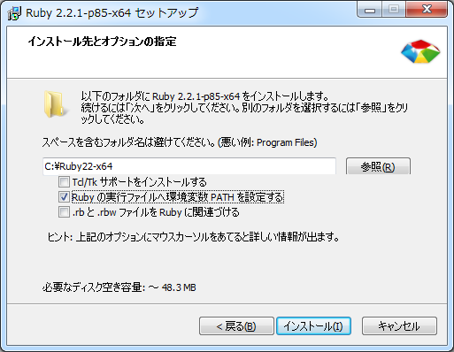

## Rubyのインストール
今回はWindows用の[RubyInstaller](http://rubyinstaller.org/)を使用。

ただし、本格的な開発をするときはMacかLinuxを用意した方が良い。  
Windowsでは動作しないライブラリが少なくないので…

1. http://rubyinstaller.org/ へ
2. ダウンロードページへ
3. 最新版のインストーラを入手 [[32bit](http://dl.bintray.com/oneclick/rubyinstaller/rubyinstaller-2.2.1.exe)] [[64bit](http://dl.bintray.com/oneclick/rubyinstaller/rubyinstaller-2.2.1-x64.exe)]
4. インストーラを実行。一応ruby.exeにパスを通しておく。


5. インストールの確認。コマンドプロンプトからruby -v を叩いてみる。

```dos
> ruby -v
ruby 2.2.1p85 (2015-02-26 revision 49769) [x64-mingw32]
```

----

[Hello Worldを書いてみる](03_helloworld.md)
